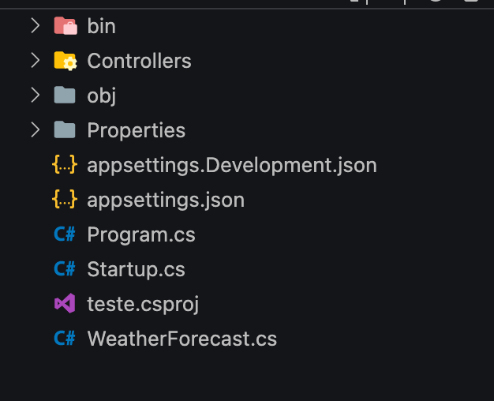

## Gerador de Cartão de crédito Virtual - .NET / EF 


#### RESUMO
O objetivo desse artigo é ensinar como desenvolver uma API para geração de cartões de crédito virtuais. As tecnologias ultilizadas aqui são: C#, .NET 5, Entity Framework e MYSQL;
Então antes de tudo, certifique-se que você tem tudo isso instalado no seu computador.
Vamos começar!

#### Criando aplicação...
Para começar a desenvolver, você precisa primeiro iniciar a aplicação. para fazer isso, inicie um projeto novo com o template de webapi, daremos o nome de "teste", parece bobo, mas é apenas um exemplo.
Execute o comando: 
```shell
$ dotnet new webapi --name teste
```
Ao executar este comando, será criada uma pasta com a base do projeto. Entre nela.
Dentro da pasta você encontrará os seguintes arquivos:

Mas calma ai! Antes de começar a desenvolver, você precisa limpar o projeto primeiro. 
Exclua o arquivos:
    * `WheaterForecast.cs`
    * `Controllers/WeatherForecastController.cs`

### Configurando aplicação

#### Instalando pacotes
Estamos quase lá, falta pouco para você começar a ver os códigos haha! 
Agora você precisa instalar os pacotes necessários para sua aplicação funcionar. Execute os seguintes comandos:
```shell
$ dotnet add package Microsoft.AspNetCore.Mvc.NewtonsoftJson
$ dotnet add package Microsoft.EntityFrameworkCore
$ dotnet add package Microsoft.EntityFrameworkCore.Design
$ dotnet add package Microsoft.EntityFrameworkCore.Tools
$ dotnet add package Pomelo.EntityFrameworkCore.Mysql
```
Se tudo ocorrer bem, todas os pacotes serão listados no arquivo `teste.csproj` de configuração.

#### Configurando banco de dados

Para configurar o banco de dados, você precisa adicionar o item seguinte e trocar pelas suas configurações MYSQL, no topo do arquivo `appsettings.json`:
```json
"ConnectionStrings": {
    "DefaultConnection": "server=host; port=3306; database=database; user=username; password=pass; Persist Security Info=False"
},
[...]
```
#### Confingurando arquivo de inicializacão

Por fim, no arquivo `startup.cs` você precisa adicionar o seguinte trecho de código no topo da função 'ConfigureServices':
```csharp
string mySqlConnection = Configuration.GetConnectionString("DefaultConnection");
services.AddDbContextPool<AppDbContext>(options => 
    options.UseMySql(
        mySqlConnection, 
        ServerVersion.AutoDetect(mySqlConnection)
    )
);

services.AddControllers()
    .AddNewtonsoftJson(options =>
    options.SerializerSettings.ReferenceLoopHandling =Newtonsoft.Json.ReferenceLoopHandling.Ignore
);
```
O trecho acima, configura a manipulação de JSON e banco de dados na sua aplicação.


### Criando entidades / Modelos
para manipular as informacões e as tabelas, você precisa criar os modelos para a sua aplicação; Primeiro crie uma pasta chamada Models.

Em seguida crie os arquivos:

* `Cartao.cs`:
```csharp
using System.ComponentModel.DataAnnotations;
using System.ComponentModel.DataAnnotations.Schema;

namespace teste.Models
{
    public class Cartao
    {
        [Key]
        public int id { get; set; }
        
        public int numero { get; set; }

        
        [ForeignKey("clienteId")]
        public Cliente cliente  { get; set; }
    }
}
```
* `Cliente.cs`:
```csharp
using System.Collections.Generic;
using System.ComponentModel.DataAnnotations;

namespace teste.Models
{
    public class Cliente
    {
        [Key]
        public int id { get; set; }

        [Required(ErrorMessage = "Email é Obrigatório")]
        public string email { get; set; }

        public virtual List<Cartao> cartoes { get; set; }
    }
}
```

E por fim, o arquivo de configuração para o seu banco de dados chamado de `AppDbContext.cs`:
```csharp
using Microsoft.EntityFrameworkCore;

namespace teste.Models
{
    public class AppDbContext : DbContext 
    {
        public AppDbContext(DbContextOptions<AppDbContext> options) : base(options)
        {
        }

        public DbSet<Cliente> Cliente { get; set; }
        public DbSet<Cartao> Cartao { get; set; }

        protected override void OnModelCreating(ModelBuilder modelBuilder) 
        {
        }
    }
}
```

### Criando banco de dados
Agora crie o seu banco de dados no mysql!
Primeiro Execute o seguinte comando para criar as migrations:
```shell
$ dotnet ef migrations add inicial -v
```
Note que foi criada uma pasta chamada 'Migrations' dentro do seu projeto.
Por fim, crie o seu banco de dados executando o comando:
```shell
$ dotnet ef database update
```
Se tudo ocorrer bem, o seu banco de dados será criado no MYSQL.


### Criando os endpoints
Chegamos na ultima parte, criar os endpoints onde você poderá se comunicar com a sua aplicação.

Dentro da pasta 'Controller' crie o arquivo `ClienteController.cs`. Dentro dele ficará assim:
```csharp
using System;
using System.Linq;
using System.Threading.Tasks;
using System.Collections.Generic;

using Microsoft.AspNetCore.Mvc;
using Microsoft.EntityFrameworkCore;
using Microsoft.Extensions.Logging;

using teste.Models;

namespace teste.Controllers
{
    [ApiController]
    [Route("v1/cliente")]
    public class ClienteController : ControllerBase {

        [HttpGet]
        [Route("{email}")]
        public async Task<ActionResult<List<Cliente>>> Get([FromServices] AppDbContext context, string email)
        {   
            var clientes = await context.Cliente
                .Where(client => client.email.Equals(email))
                .Include(client => client.cartoes)
                .ToListAsync();
            return clientes;
        }
    }
}
```
No arquivo, você terá criado uma classe controller e o endpoint para obter todos os cartões do cliente.
Em seguida crie o arquivo `CartaoController.cs`:
```csharp
using System;
using System.Linq;
using System.Threading.Tasks;
using System.Collections.Generic;

using Microsoft.AspNetCore.Mvc;
using Microsoft.EntityFrameworkCore;
using Microsoft.Extensions.Logging;

using teste.Models;

namespace teste.Controllers
{
    [ApiController]
    [Route("v1/cartao")]
    public class CartaoController : ControllerBase {
        

        [HttpPost]
        [Route("")]
        public async Task <ActionResult<int>> Post([FromServices] AppDbContext context, [FromBody] Cliente body)
        {       
            if (ModelState.IsValid) {
                
                Cliente clientExists = (Cliente) await context.Cliente
                                                        .Where(c => c.email.Equals(body.email))
                                                        .SingleOrDefaultAsync();

                // clientExists;
                if (clientExists == null) {
                    context.Cliente.Add(body);
                    await context.SaveChangesAsync();
                }
                Cliente cliente = clientExists == null ? body : clientExists;

                Random rnd = new Random();
                int creditCardNumber = rnd.Next(10000000, 99999999);
                Cartao cartao = new Cartao() { cliente = cliente, numero = creditCardNumber };
                context.Cartao.Add(cartao);
                await context.SaveChangesAsync();

                return creditCardNumber;
                
            } else {
                return BadRequest(ModelState);
            }           
        
        }        
    }
}
```


Pronto, agora pode usar a sua ferramenta de testes, seja postman, insomnia, e usara a sua aplicação :)


